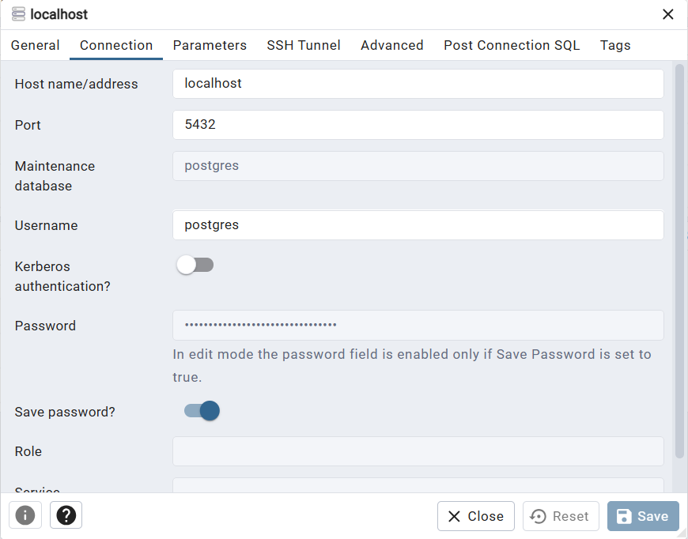
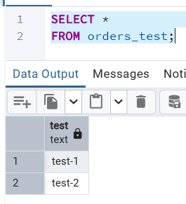

###### Подключение из контейнера с клиентом к контейнеру с сервером
```sh
docker exec -it psql psql -h postgres -U postgres
```

###### Запросы для таблицы orders_test
```sql
CREATE TABLE orders_test (  
    test TEXT NULL  
);

INSERT INTO orders_test (test)
VALUES ('test-1'),
       ('test-2');

SELECT *
FROM orders_test;
```

###### Подключение и выполнение запросов в контейнере с psql


###### Подключение с хоста через pgAdmin


###### Выполнение запроса с хоста через pgAdmin

